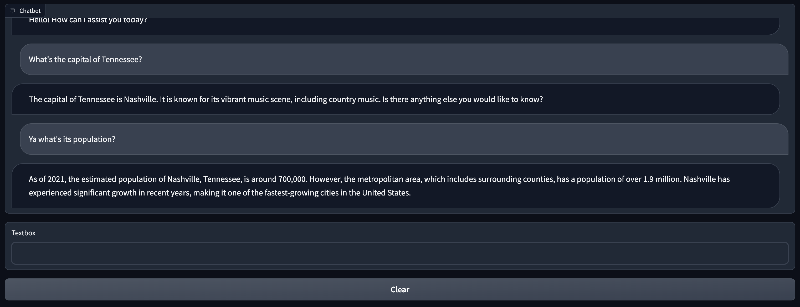

# End-to-end LLM Deployments in Databricks 😎

Just messing around with different ways of quickly deploying and interacting with LLMs served on Databricks...

A couple things:
* In `/notebooks` you will find some Databricks notebooks which can be used to develop and deploy a Llama-7B chat model to a serving endpoint. These notebooks were ran on a single-node GPU cluster with 32GB of VRAM using DBR 13.3 ML LTS.
* This POC uses Langchain, so you can quickly swap out the LLM you wish to use by simply redefining `LLM` in `app.py`
* To run the Gradio chat UI:
  
  ```bash
  python app.py
  ```

